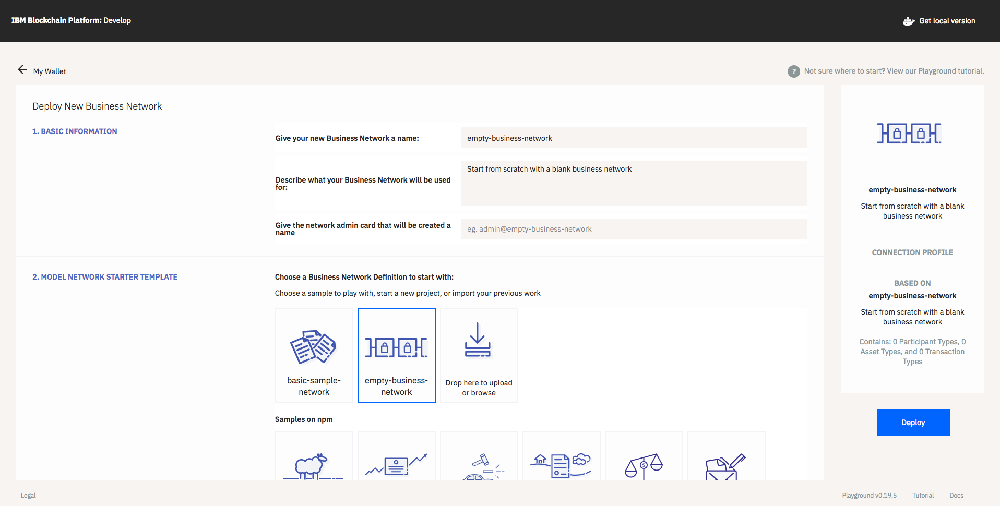
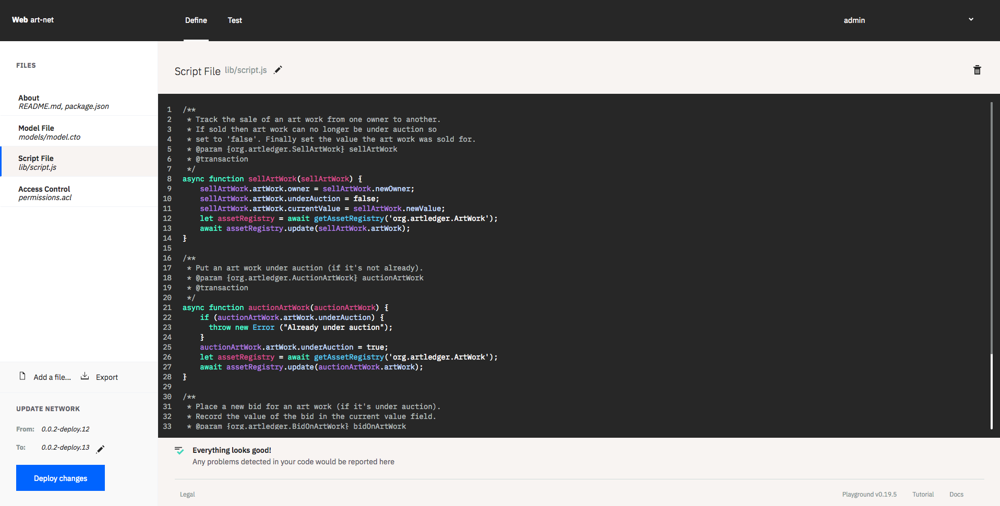

# Step 3: Define a Business Network
The IBM Blockchain Platform provides a free development environment based on industry standard tools and technologies (Hyperledger Composer, Hyperledger Fabric, JavaScript, Docker, etc) that you can use to model and code a ready-to-deploy use case. The [online Playground](https://ibm-blockchain.github.io/develop/installing/installing-index), where you can define your first network, can be got [here](https://blockchaindevelop.mybluemix.net/editor). It can also be run locally in Docker.

When you first open the online Playground you'll see this screen.

If you select the `empty-business-network` and then the `Deploy` button you will get a new set of Business Network Definition files to begin working with (the example in the screen shot below shows an already completed script file for `art-ledger`).

Business Network Definitions are composed of:

* a set of model files
* a set of JavaScript files
* an Access Control (ACL) file

The model files define the business domain for a business network, while the JavaScript files contain transaction processor functions. The transaction processor functions run on a Hyperledger Fabric and have access to the asset registries that are stored in the world state of the Hyperledger Fabric blockchain. The Access Control file contains a set of access control rules that define the rights of the different participants in the business network. More information on this as well as descriptions of the modelling and ACL language can be found [here](https://ibm-blockchain.github.io/develop/business-network/businessnetworkdefinition).

The files used by **art-ledger** can be found in the `archive` directory [here](../archive).

You should use the web playground to define and test your network before deploying it onto IBM Blockchain. You can either define your own network or use the **art-ledger** network defined in this project. The rest of these instructions assume you are using **art-ledger** so if you have defined your own network you will need to change the names to those you have used. If you are defining your own model and logic files you should do so in playground then paste your model file into `models/org.artledger.cto` (or whatever you have called your project) and logic into `lib/logic.js`. Note that for **art-ledger** you can get the initial versions of both of these files from the subdirectory [`archive`](../archive).

Now go to [Step 4: Create Business Network Artefacts](../docs/04%20Business%20Network%20Artefacts.md).
