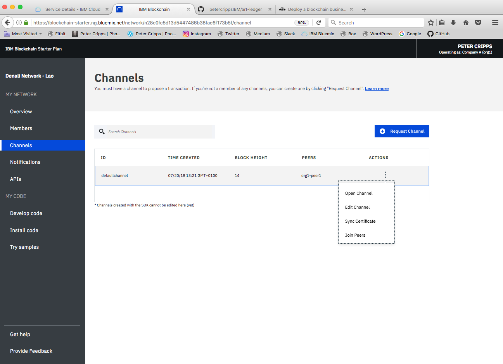

# Step 4: Create Business Network Artefacts
In this step we will create the required artefacts that are needed for our blockchain network. We will be using the `composer` command line tool that we downloaded previously. Essentially there are two types of artefact we need.

A *Business Network Card* provides all of the information needed to connect to a blockchain business network. It is only possible to access a blockchain business network through a valid Business Network Card. A Business Network Card contains an *Identity* for a single *Participant* within a deployed business network. You can have multiple Business Network Cards for a single deployed business network, where those Business Network Cards belong to multiple Participants.

Before a business network definition can be deployed it must be packaged into a *Business Network Archive* file. The composer `archive create` command is used to create a business network archive file from a business network definition folder on disk. These will be the artefacts created earlier consisting of model, logic and permissions files.

Remember to substitute the name of your own network at the appropriate points when executing the commands in these steps.

Finally, before starting this step, make sure you are in your project root directory and have exported the `NODE_CONFIG` environment variable using this instruction:
```
$ export NODE_CONFIG=$(cat cardstore-cloudant.json)
```

## Step 4.1: Create and Import the CA Card
First we create the *Certiicate Authority* (CA) card.
```
$ composer card create -f ca.card -p connection-profile.json -u admin -s <your-enrollSecret>
```
You obtain `<your-enrollSecret>` from the `connection-profile.json` created earlier. Open that file and search for `enrollSecret` then copy the secret itself onto the command line. Next import the newly created card as shown:
```
$ composer card import -f ca.card -c ca
```
Check the CA card is created by issuing the command:
```
$ composer card list
```
Finally request the valid public/private keys for the admin from the Certificate Authority using:
```
$ composer identity request --card ca --path ./credentials
```
This should result in a new directory `credentials` being created with three `.pem` files.

## Step 4.2: Add a Certificate to the IBM Starter Plan
The certificate you require is in the file `admin-pub.pem` in the directory `credentials`. Copy the entire contents of that file (including the `-----BEGIN CERTIFICATE-----` and `-----END CERTIFICATE-----` lines) to the clipboard.

Next go to the Network Monitor for your blockchain network on IBM Cloud Starter Plan, select `Members` then `Certificates` and `Add Certificate`. Name the certificate `admin` then paste the certificate into the field as shown and select `Submit`.


Next you need to sync the newly added certificate across channels by slecting `Channels`, `Synchornize` then `Submit`



## Step 4.3: Create and Import the Admin Card
Create an admin card with channel admin and peer admin roles, and then import the newly created card:
```
$ composer card create -f adminCard.card -p connection-profile.json -u admin \
    -c ./credentials/admin-pub.pem -k ./credentials/admin-priv.pem \
    --role PeerAdmin --role ChannelAdmin
$ composer card import -f adminCard.card -c adminCard
```

## Step 4.4: Install and Start the Business Network
Using the admin card just created we now install and start the business network onto our blockchain network. Before creating the business network archive (`.bna`) file you'll need to tweak the `permissions.acl` file. The permissions you get by default probably won't be compatible with changes you'll have added in the model file. If you get that problem then paste the contents of `permissions.acl` [here](../archive/permissions-v0.0.1.acl) into the one in the project root directory.

First create the Business Network Archive or `.bna` file:
```
$ composer archive create -t dir -n .
```
This will result in the creation of a file called `art-ledger@0.0.1.bna`. IBM Blockchain Starter Plan does not accept files with a `@` so rename the file, removing that character (e.g. to `art-ledger-0.0.1.bna`). Then install the business network and Hyperledger Composer runtime to the IBM Blockchain Starter Plan instance:
```
$ composer network install -c adminCard -a art-ledger-0.0.1.bna
```
This will take a few seconds. Once installed start the business network:
```
$ composer network start -c adminCard -n art-ledger -V 0.0.1 -A admin -C ./credentials/admin-pub.pem -f delete_me.card
```
You can check the network is up and running by issuing a `ping` command:
```
$ composer network ping -c admin@art-ledger
```
This will return some information about the network including the version number of the network composer runtime (o.19.5 if you've been using the same version numbers in these instructions) and your network (0.0.1).

The file `delete_me.card` is redundant so can be deleted.

At this point if you check the block height of your channel you should see it set at '4' meaning there are four blocks in your network corresponding to:
* 0 - the GENESIS block
* 1 - addition of the certificate
* 2 - instantiation of the chaincode
* 4 - invocation of the chaincode

## Step 4.5: Create and Import the Network Administrator Card
The network administrator is responsible for running the network by issuing identities and such to other participants on the network. We need to create and import the business network card for the network administrator.
```
$ composer card create -n art-ledger -p ./connection-profile.json -u admin -c ./credentials/admin-pub.pem -k ./credentials/admin-priv.pem
$ composer card import -f admin@art-ledger.card
```
You should now have the three cards you need created and installed. Issue the command:
```
$ composer card list
```
and you should see the following.


You can also check your `composer-wallets` Cloudant database where you should see the three cards that have been created.

Now go to [Step 5: Expose and Test REST APIs](../docs/05%20REST%20APIs.md).
